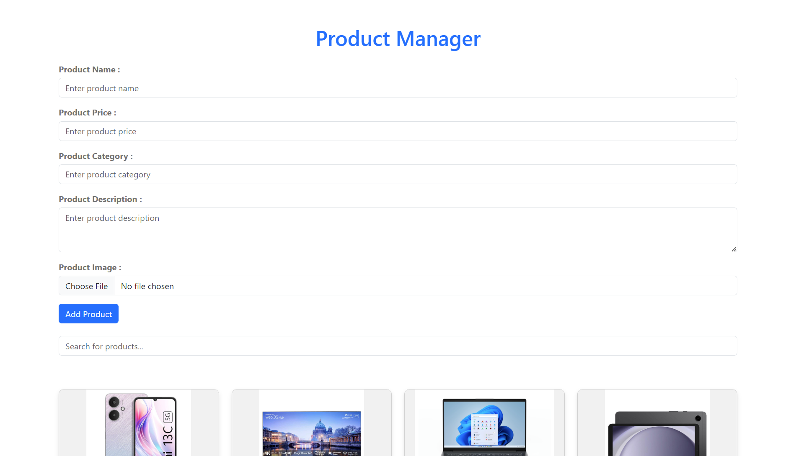
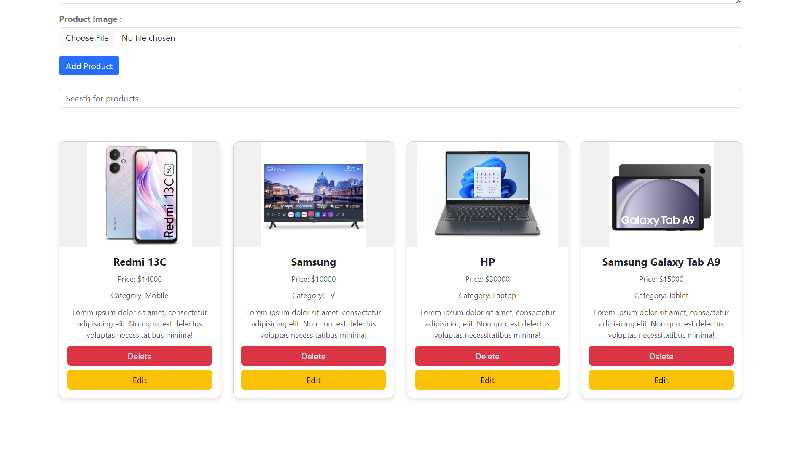
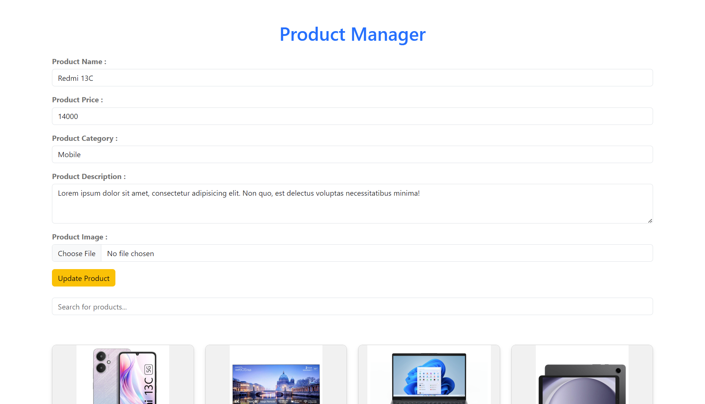
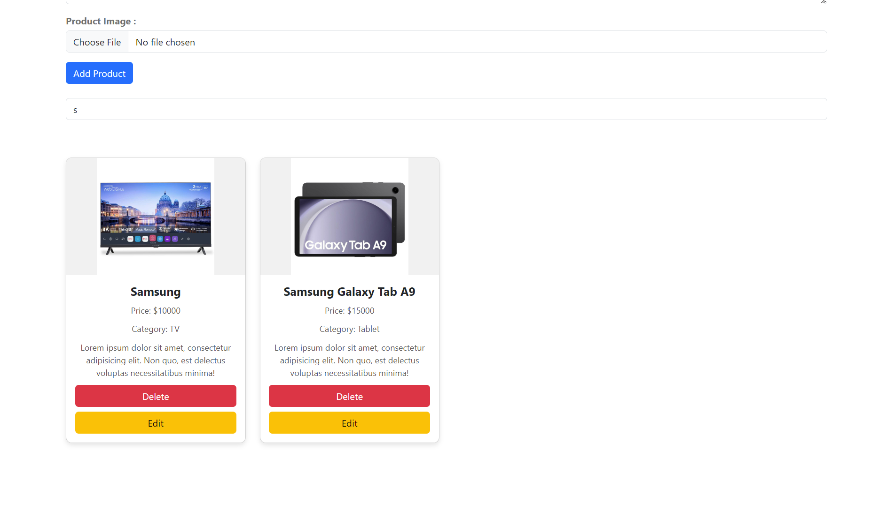

## Getting Started

### Prerequisites

To run the project locally, you only need a web browser.

### How to Use

1. **Clone the repository** or download the source code.
2. Open the `index.html` file in your browser.
3. Use the input form to add a product:
   - Fill out the product details: name, price, category, description, and upload an image.
   - Click the **"Add Product"** button to save the product.
4. **View products** in the product list below the form.
5. Use the **"Edit"** and **"Delete"** buttons to modify or remove a product.
6. Use the search bar to filter products by name or category.

### File Description

- **`index.html`**: Contains the structure of the Product Manager interface.
- **`style.css`**: Custom CSS styles for the product display cards, input forms, and other elements.
- **`main.js`**: Handles product management logic including adding, deleting, editing, searching, and local storage.

## Screenshots

### 1. Add Product Form

### 2. Product List Display

### 3. Edit Product Form

### 4. Search Product Feature

## Future Improvements

- Integrate a database to replace local storage for data persistence.
- Add user authentication for product management.
- Implement product sorting and advanced filtering.
- Enhance the UI/UX with more interactive components.

## License

This project is open source and available under the [MIT License](LICENSE).

## Author

- Ahmed Hassan - (https://github.com/xZegAs)
